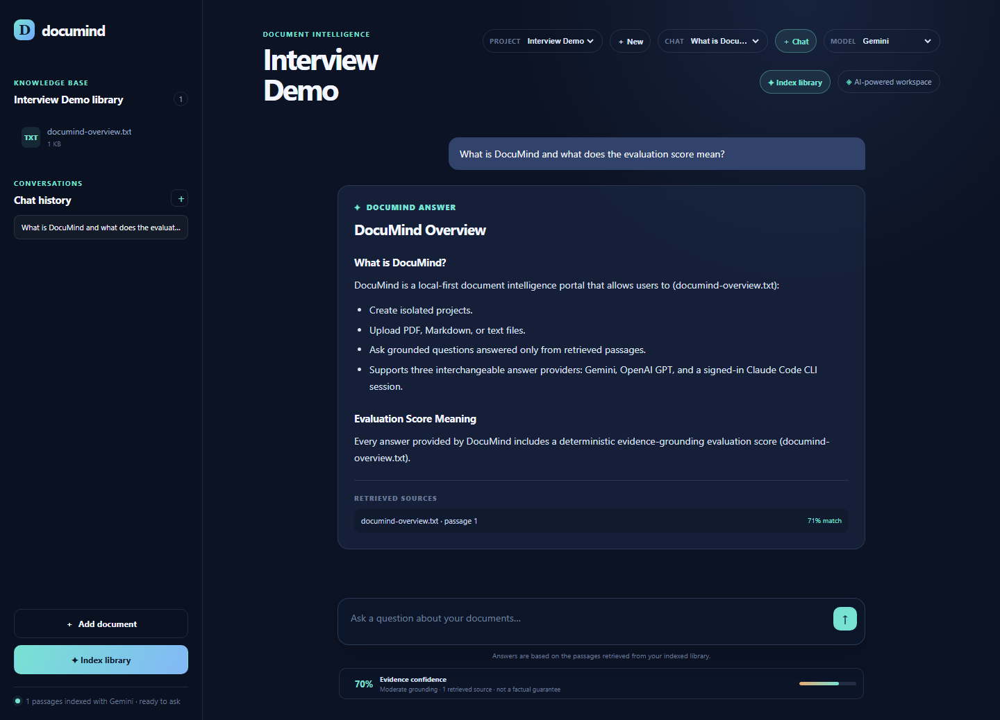
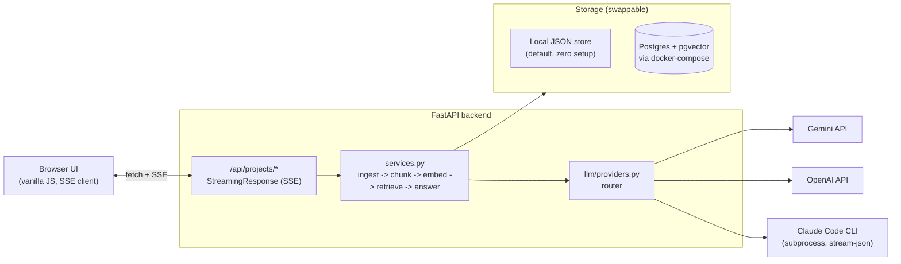

# DocuMind

DocuMind is a local-first Retrieval-Augmented Generation (RAG) portal: create isolated projects, upload PDFs/Markdown/text, and ask questions that are answered **only** from retrieved passages. Every answer ships with its source citations and a deterministic evidence-grounding score — not a factual guarantee, but a transparent signal for how well the answer is actually supported by what was retrieved.

Answers stream token-by-token over Server-Sent Events, and can come from **Gemini**, **OpenAI GPT**, or a **signed-in Claude Code CLI session**, interchangeably per project.



## Highlights

- **Multi-provider, one interface** — Gemini and OpenAI use provider embeddings + cosine similarity; the Claude CLI path uses a local lexical (term-overlap) retriever and never calls an embeddings API.
- **Streaming answers (SSE)** — the FastAPI backend streams tokens as the model generates them; the frontend renders them live, then finalizes formatting, sources, and the grounding score.
- **Deterministic grounding evaluation** — no extra model call. The score blends retrieval similarity with lexical overlap between the answer and its source passages, so it's cheap, fast, and reproducible.
- **Swappable storage** — a local JSON vector store by default (zero setup), or Postgres + [pgvector](https://github.com/pgvector/pgvector) via one `DATABASE_URL` env var and `docker compose up -d`. Same interface, no code changes elsewhere.
- **Project isolation** — every project gets its own documents folder, index, and chat history; nothing leaks across projects.
- **Tested** — 48+ pytest tests across chunking, retrieval, evaluation, project/chat storage, and the full API (streaming included), plus a real Postgres integration test that's skipped gracefully when Docker isn't running.

## Architecture



Request flow for a chat message: the browser POSTs a question to `/api/projects/{id}/chats/{chat}/messages`; the backend retrieves the top passages (embedding similarity or lexical overlap), streams the model's answer back as SSE `token` events, then emits a final `done` event with the full answer, sources, evidence-grounding score, and updated chat history — which is what gets persisted to `chats.json`.

## Quickstart

1. **Add credentials** to `.env` (copy from `.env.example`) for whichever provider(s) you want:

   ```env
   GEMINI_API_KEY=your-real-key
   # OPENAI_API_KEY=your-real-key
   ```

   Claude Pro / CLI needs no API key — just `claude auth login` locally.

2. **Install dependencies:**

   ```powershell
   .\.venv\Scripts\python.exe -m pip install -r requirements.txt
   ```

3. **(Optional) Start Postgres + pgvector** instead of the local JSON store:

   ```powershell
   docker compose up -d
   ```

   Then uncomment `DATABASE_URL` in `.env`. Leave it commented to keep using the zero-setup local JSON store.

4. **Start the server:**

   ```powershell
   .\.venv\Scripts\python.exe -m backend.api.server
   ```

5. Open `http://127.0.0.1:8000`. Create a project, upload a PDF/Markdown/text file, click **Index library**, pick a provider, and ask a question. Reindex after switching providers — an index is tied to the provider that built it.

## Running the tests

```powershell
.\.venv\Scripts\python.exe -m pytest
```

All LLM calls are mocked, so the suite runs offline with no API keys. Tests that need Postgres (`tests/test_pg_vector_store.py`) auto-skip unless `docker compose up -d` is running.

## Project layout

```
backend/
  ingest/     PDF/Markdown/text loading and paragraph-aware chunking
  llm/        Gemini, OpenAI, and Claude CLI adapters (sync + streaming) and provider routing
  db/         local JSON vector store, Postgres/pgvector store, and the factory that picks one
  api/        FastAPI app: routes, SSE streaming, static asset serving
  frontend/   vanilla JS/HTML/CSS single-page UI
  projects.py, conversations.py, services.py, evaluation.py
tests/        pytest suite (mirrors the backend/ layout)
docker-compose.yml   Postgres + pgvector, for the optional storage backend
```

`projects/` (per-project documents/index/chats) and `data/index.json` (the General library's index) are generated locally and not committed.

## Known limitations

- Single-user, local-only — there's no auth, and it's not designed to be exposed to the internet as-is.
- The Claude CLI path streams real token deltas parsed from `claude -p --output-format stream-json`, but as a subprocess integration it's inherently less robust than the native Gemini/OpenAI streaming APIs.
- Postgres/pgvector uses exact nearest-neighbor search (no ANN index) — fine at the scale this project targets, not tuned for millions of chunks.
